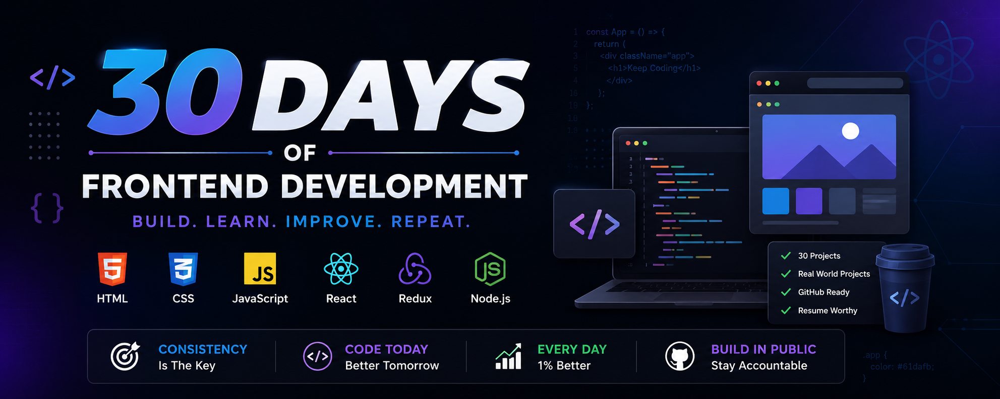

  

# 🚀 30 Days of Frontend Development

Building one frontend project every day to master HTML, CSS, JavaScript, and React.

---

## 🎯 Goal

Improve problem-solving skills.

Master JavaScript.

Build production-ready React applications.

Create resume-worthy projects.

---

## 🛠 Tech Stack

HTML

CSS

JavaScript

React

Git

GitHub

---

## 📅 Progress

| Day | Project | Status |
|------|---------|--------|
| 1 | Counter App | ✅ |
| 2 | Color Palette Generator | ⏳ |
| 3 | Digital Clock | ⏳ |

...

---

## 📌 Rules

✔ No AI generated code

✔ Build everything myself

✔ Push every project to GitHub

✔ Deploy every project

✔ Learn every concept deeply
